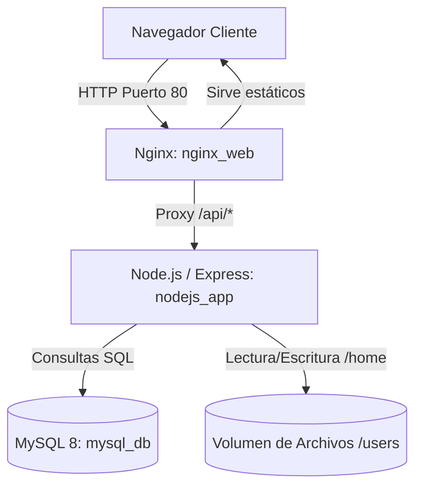

# Análisis del Proyecto: Sistema de Gestión de Archivos

Este documento contiene un análisis detallado del proyecto para entender su estructura, funcionamiento y dependencias. Servirá como referencia técnica para cualquier modificación, ampliación o depuración futura.

---

## 1. Arquitectura General del Sistema

El proyecto está diseñado como una aplicación web modular y dockerizada. Utiliza **Docker Compose** para orquestar tres servicios principales en una red bridge interna llamada `app_network`:



### Servicios en `docker-compose.yml`
1. **`nginx` (nginx_web)**: Servidor web expuesto en el puerto `80`.
   - Sirve el frontend estático montado desde `./paginas/` en `/usr/share/nginx/html`.
   - Proxya peticiones `/api/` al backend y `/uploads/` para previsualizaciones rápidas.
   - Aplica límites de subida de hasta 50GB (`client_max_body_size 50000M`) y timeouts extendidos para peticiones largas.
2. **`nodejs` (nodejs_app)**: Backend basado en Node.js 18 (Alpine).
   - Corre Express en el puerto `3000` (interno).
   - Gestiona lógica de negocio, autenticación, subidas de archivos, y administración.
   - Se monta `./nodejs` en `/app` para desarrollo, `./users` en `/home` para persistencia de archivos, y `./mysql` en `/mysql`.
3. **`mysql` (mysql_db)**: Base de datos MySQL.
   - Almacena información de usuarios, metadatos de archivos y enlaces públicos.
   - Inicializa la BD mediante scripts en `/docker-entrypoint-initdb.d` mapeado desde `./mysql/`.
   - Utiliza secretos ubicados en `./secrets/` para credenciales seguras.

---

## 2. Modelo de Base de Datos

La estructura relacional y de configuración general se define en [01-inicio.sql](file:///c:/Users/Administrador/Desktop/Proyecto-Web/Proyecto-Web/mysql/01-inicio.sql). El esquema principal consta de las siguientes tablas:

### Tabla: `users`
Almacena credenciales, cuotas de disco y permisos del sistema.
- `id` (INT, PK, Auto-increment)
- `username` (VARCHAR(50), Unique)
- `password` (VARCHAR(32)) - Contraseñas en texto plano/MD5.
- `role_mask` (INT) - Sistema bitmask granular para permisos.
- `status` (ENUM('active', 'disabled', 'banned')) - Estado del usuario.
- `quota_bytes` (BIGINT) - Cuota personalizada (NULL para global).
- `max_file_size_bytes` (BIGINT) - Límite de tamaño de archivo (NULL para global).
- `bandwidth_kbps` (INT) - Límite de ancho de banda en descargas.
- `token` y `token_expires` - Sesión temporal de 1 hora.
- `last_access`, `last_ip`, `registration_ip`

### Tabla: `files`
Metadatos de cada archivo subido físicamente.
- `id` (INT, PK)
- `user_id` (INT, FK -> users)
- `filename` (VARCHAR(255)) - Nombre único autogenerado en disco para evitar colisiones.
- `original_name` (VARCHAR(255)) - Nombre original del archivo.
- `filepath` (VARCHAR(500)) - Ruta absoluta en el volumen del contenedor.
- `filesize` (BIGINT) - Tamaño en bytes (BIGINT permite soportar archivos > 2GB).
- `uploaded_at` (TIMESTAMP)

### Tabla: `shared_links`
Enlaces públicos con caducidad opcional.
- `id` (INT, PK)
- `token` (VARCHAR(64), Unique) - Token del link público de descarga.
- `user_id` (INT, FK -> users)
- `file_path` (VARCHAR(512))
- `original_name` (VARCHAR(255))
- `expires_at` (DATETIME, NULLable)
- `downloads` (INT, Default 0) - Contador de descargas.

### Tablas de Soporte y Seguridad:
- **`banned_ips`**: Bloqueo de direcciones IP.
- **`admin_logs`**: Logs de auditoría de acciones administrativas.
- **`global_settings`**: Configuración global (`default_quota_bytes`, `default_max_file_size_bytes`, `default_bandwidth_kbps`).

---

## 3. Funcionamiento del Backend

El backend se orquesta principalmente desde [server.js](file:///c:/Users/Administrador/Desktop/Proyecto-Web/Proyecto-Web/nodejs/server.js). Sus flujos principales incluyen:

### 3.1. Inicialización y Sincronización
- **Espera de MySQL**: Utiliza [wait-for-mysql.js](file:///c:/Users/Administrador/Desktop/Proyecto-Web/Proyecto-Web/nodejs/wait-for-mysql.js) para esperar conexiones saludables antes de levantar Express.
- **Chequeo de columnas**: El servidor verifica la existencia de campos como `role_mask`, `quota_bytes`, etc., y los crea mediante `ALTER TABLE` si no existen.
- **Creación de Admin por Defecto**: Genera el usuario `admin` con contraseña leída del secreto `./secrets/admin_password` y le asigna el bitmask con todos los permisos.
- **Creación de directorios físicos**: Asegura que exista la ruta `/home/<username>` para cada usuario en la base de datos.
- **Sincronización de BD a SQL**: Invoca [sync_bd_to_sql.js](file:///c:/Users/Administrador/Desktop/Proyecto-Web/Proyecto-Web/nodejs/sync_bd_to_sql.js) para persistir un snapshot en `./mysql/02-insertar.sql` en el arranque y tras registrar/eliminar usuarios.

### 3.2. Control de Permisos por Bitmask
El backend define privilegios granulares combinando bits en hexadecimal:
```javascript
const PERMISSIONS = {
    LOGIN:                  0x00000001, // Iniciar sesión
    ADMIN:                  0x00000002, // Ver archivos de otros
    SUPERADMIN:             0x00000004, // Acceder a panel
    FILE_MANAGER:           0x00000008, // Gestor básico
    MANAGE_USERS_STATUS:    0x00000010, // Activar/desactivar/banear
    MANAGE_USER_LIMITS:     0x00000020, // Cambiar cuotas y anchos de banda
    KICK_USERS:             0x00000040, // Expulsar (quitar token)
    CHANGE_ANY_PASSWORD:    0x00000080, // Cambiar contraseña de otros
    DELETE_USERS:           0x00000100, // Eliminar usuarios del sistema
    MANAGE_IPS:             0x00000200, // Banear IPs
    MANAGE_GLOBAL_SETTINGS: 0x00000400  // Cambiar límites globales
};
```
La función `hasPermission(token, requiredBit)` verifica si el token es válido y si tiene habilitado el bit correspondiente. El rol `SUPERADMIN` hereda implícitamente todos los accesos.

### 3.3. Rutas Clave de Archivos
- **Subida (`POST /api/upload/:username`)**: Utiliza `multer` con almacenamiento seguro en `/home/:username`. Sanitiza nombres, maneja la colisión (añade `_1`, `_2` si ya existe) y restringe la subida si se supera el límite de cuota total o de archivo único mediante el middleware `checkUploadQuota`.
- **Mover / Renombrar**: Modifican los archivos físicamente en disco usando `fs.renameSync` y actualizan la base de datos para mantener integridad.
- **Validación de Rutas**: Para prevenir ataques de **Path Traversal**, cada ruta de archivo se resuelve usando `path.resolve()` y se comprueba que empiece con el directorio base del usuario:
  ```javascript
  if (!resolvedTarget.startsWith(resolvedUserDir)) {
      return res.status(403).json({ success: false, message: 'Acceso denegado' });
  }
  ```

---

## 4. Frontend y Flujo de Navegación

El frontend se estructura con componentes HTML interactivos, CSS personalizado y Vanilla JavaScript.

### Flujo de Usuario:
1. **[login.html](file:///c:/Users/Administrador/Desktop/Proyecto-Web/Proyecto-Web/paginas/login.html)** / [login.js](file:///c:/Users/Administrador/Desktop/Proyecto-Web/Proyecto-Web/paginas/login.js):
   - Pantalla de inicio para registrarse o iniciar sesión.
   - Guarda los datos de sesión (`token`, `expires`, `isAdmin`, `isSuperadmin`) en el `localStorage`.
2. **[apps.html](file:///c:/Users/Administrador/Desktop/Proyecto-Web/Proyecto-Web/paginas/apps.html)** / [apps.js](file:///c:/Users/Administrador/Desktop/Proyecto-Web/Proyecto-Web/paginas/apps.js):
   - Selector intermedio. Muestra dos tarjetas: "Gestor de Archivos" y "Panel de Administración".
   - La tarjeta de administración se oculta mediante `display: none` a menos que `isAdmin` sea verdadero.
   - Al seleccionar Panel de Administración, guarda un token temporal en `sessionStorage` (`adminAccessGranted`) para autorizar el paso.
3. **[gestorarchivos.html](file:///c:/Users/Administrador/Desktop/Proyecto-Web/Proyecto-Web/paginas/gestorarchivos.html)** / [gestorarchivos.js](file:///c:/Users/Administrador/Desktop/Proyecto-Web/Proyecto-Web/paginas/gestorarchivos.js):
   - Interfaz principal del usuario.
   - Permite subir mediante drag-and-drop, crear carpetas, buscar archivos en tiempo real, filtrar por extensión o tipo, y realizar acciones masivas (eliminar, descargar selección en ZIP o mover).
   - Muestra un Dashboard visual de disco y transferencia usando **Chart.js**.
4. **[admin.html](file:///c:/Users/Administrador/Desktop/Proyecto-Web/Proyecto-Web/paginas/admin.html)** / [admin.js](file:///c:/Users/Administrador/Desktop/Proyecto-Web/Proyecto-Web/paginas/admin.js):
   - Consola del administrador. Dividida en 3 pestañas:
     - *Usuarios*: Lista usuarios con su uso de disco, última IP y fecha de registro. Permite gestionar cuotas/permisos, banear, cambiar contraseñas, eliminar o ver e interactuar con sus archivos.
     - *IPs Baneadas*: Lista y permite desbanear/banear IPs directamente.
     - *Configuración*: Configuración de cuota y ancho de banda por defecto.

---

## 5. Puntos de Atención e Inconsistencias Detectadas

Durante el análisis se han identificado los siguientes detalles importantes para tener en cuenta en el futuro:

> [!WARNING]
> **Redirección obsoleta en `admin.html`:**
> Al final de `admin.html` (línea 339), el script que verifica la sesión redirige a `trabajofinal.html` si esta es inválida o expira. Sin embargo, ese archivo ha sido renombrado a `gestorarchivos.html` y las redirecciones de Nginx apuntan a `login.html`. Esto provocará un error de tipo **404 Not Found**. Debe corregirse para redirigir a `login.html`.

> [!IMPORTANT]
> **Persistencia en docker-compose / users:**
> Los archivos de usuario se persisten localmente en `./users` que está mapeado a `/home` dentro del contenedor. Toda ruta lógica escrita en `server.js` como `/home/<username>` corresponde directamente a la carpeta local `./users/<username>`.

> [!NOTE]
> **Editor de Temas e Idiomas Compartido:**
> Las páginas `login.html`, `gestorarchivos.html` y `admin.html` comparten un sistema de temas dinámico y multi-idioma (Español/Inglés) que guarda sus preferencias en el `localStorage` (`userTheme`, `language`).
